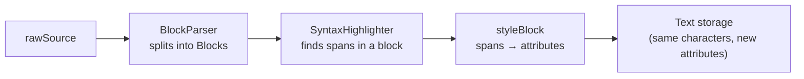
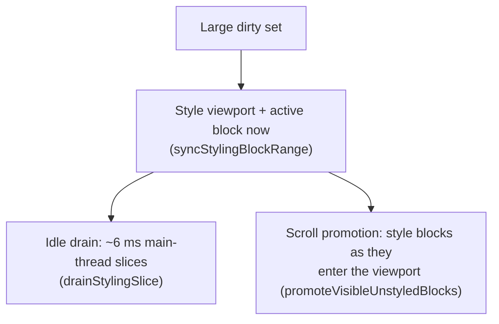

# Editor pipeline: parsing to pixels

Expands [`../ARCHITECTURE.md`](../ARCHITECTURE.md) §3 (render pipeline) and
the styling half of §4 (edit flow). The invariant it serves (storage always
equals `rawSource`) is owned by §2 there.

## 1. Why

The editor never swaps your Markdown for "rendered" text. It styles the raw
characters in place — fonts, colors, spacing — and hides the delimiters with
a near-invisible font. That keeps the on-screen text identical to the file,
so saving, undo, and cursor positions never need a translation layer.

The pipeline is *incremental* at every step because documents can be large:
re-parsing or re-styling the whole document on every keystroke would stall
typing. Each stage below has a "do only what changed" path, and the full
paths exist only for load/undo/theme changes.

## 2. High-level overview

| Stage | File | Job |
| --- | --- | --- |
| Parse | `Sources/EdmundCore/Parsing/BlockParser.swift` | Split `rawSource` into `Block`s, one per logical unit (paragraph, heading, list item, quote/callout run, code fence, display-math block, table). Multi-line constructs merge into single blocks via a lazy `LineBuffer`, so full and incremental parses consume lines identically and can't diverge. |
| Highlight | `SyntaxHighlighter.swift` + `+Walker`, `+WalkerInline`, `+CustomParsers` | Walk one block's content, produce a flat list of `Span`s. CommonMark/GFM via `swift-markdown`'s walker; Edmund's extras (callouts, `==highlight==`, wikilinks, footnotes, math, escapes, inline HTML) via the custom parsers. |
| Style | `Sources/EdmundCore/Rendering/EditorTextView+Rendering.swift` | `styleBlock(_:cursorPosition:)` turns one block's spans into attributes covering the *same* characters. Per-feature extensions (Callout, Code, Image, List, ListMarker, Math, Table, WikiLinks) handle each span kind. Delimiters get `hiddenFont` (0.01 pt) + clear color — zero visible space, still in storage. |

## 3. Specs

### The recompose paths

`Sources/EdmundCore/TextView/EditorTextView+Composition.swift` is the single
place that writes styled attributes into the text storage.

| Path | When | Cost |
| --- | --- | --- |
| `recompose(cursorInRaw:)` | `rawSource` rebuilt outside the edit path: initial load, undo/redo, indent | Full: replaces the entire storage, restyles every block. Discards every layout fragment, resetting all geometry to estimates (see [`text-system.md`](text-system.md)). |
| `recomposeDirty(_:cursorInRaw:)` | Edits, activation changes, theme refreshes — **the workhorse** | Restyles exactly the given block indices in place. Attribute-only; the string is never touched. |
| `recomposeIncremental(cursorInRaw:)` | Cursor moves between blocks without a content change | Thin wrapper: restyles just the old and new active blocks. |
| `recomposeReplacing(oldRange:with:dirty:cursorInRaw:)` | A contiguous span of `rawSource` rebuilt (Tab/Shift-Tab indent, undo diffs) | String-replaces only that span; storage and layout outside it untouched, so the viewport can't lurch. |

**Active-block raw reveal**: the block under the caret renders its *raw*
markdown, delimiters visible and editable; every other block renders styled.
`recomposeDirty` tracks `activeBlockIndex` and passes a `cursorInBlock`
offset into the active block's restyle; that offset decides which token's
delimiters are revealed as the cursor moves within the block
(`+SelectionTracking`).

### Lazy styling

Why: styling a whole large document synchronously (load, theme change) would
stall the main thread. So:

A **small** dirty set (ordinary interaction) is styled in full — visible
state transitions are never deferred. Headless (no scroll view), everything
is synchronous. Code:
`Sources/EdmundCore/TextView/EditorTextView+LazyStyling.swift`.

### Incremental parsing window

`EditorTextStorage` (`Sources/EdmundCore/TextView/EditorTextStorage.swift`)
is the `NSTextStorage` subclass backing the editor. Every
`replaceCharacters` (typing, paste, IME commit) accumulates a `PendingEdit`
(old range + length delta); multiple mutations in one event turn coalesce
into their conservative hull. `didChangeText` reads that single funnel to
drive `BlockParser.incrementalParse`, which re-splits only the affected
lines — O(edit), not O(document). A `#if DEBUG` oracle
(`verifyIncrementalParse`) cross-checks every incremental result against a
from-scratch parse. Whole-document replacements (`recompose` after
load/undo/indent) call `clearPendingEdit()` — they re-parse from scratch, so
the incremental path is never asked to reconcile a change it didn't see.

### Worked example: typing one character inside a callout

1. NSTextView calls `shouldChangeText`; Edmund records an undo snapshot.
2. NSTextView mutates the storage; `EditorTextStorage.replaceCharacters`
   accumulates the edit into `pendingEdit`.
3. NSTextView calls `didChangeText()` (`+EditFlow.swift`). Guarded by
   `!isUpdating` and `!hasMarkedText()` (never touch storage mid-IME
   composition; [`../ARCHITECTURE.md`](../ARCHITECTURE.md) §8), it calls
   `syncRawSourceFromDisplay()`.
4. That re-reads `rawSource` from storage, consumes `pendingEdit`, and runs
   `BlockParser.incrementalParse` — for one character inside one callout,
   the parse re-splits just that quote run (plus the block before it, per
   the parser's lookback rule) and returns a one-index `changed` window.
5. The dirty set = that window + old/new active block (+ any
   list-indent-affected blocks; none here).
6. `recomposeDirty` restyles exactly that block: box decoration, header
   icon, body styling all re-derived. TextKit 2 layout is invalidated for
   the block's range so the box height picks up a wrapped line.
7. If the caret math and TextKit 2's queued selection fixup disagree (the
   delete-drift investigation), the caret is re-asserted after the restyle.

No other block is touched; outside the callout only attributes changed —
the string never did.
